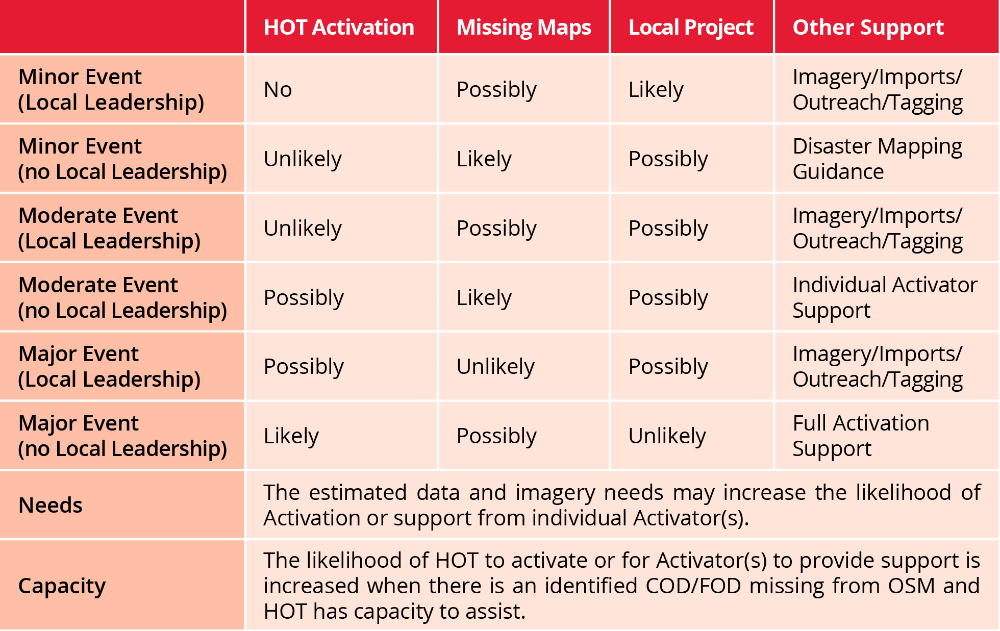
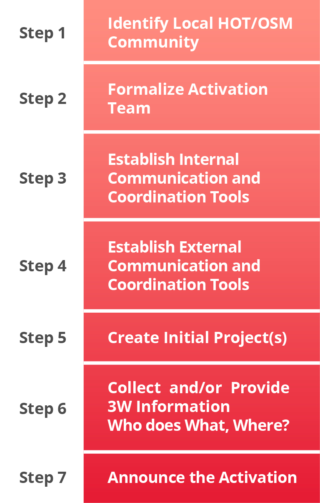
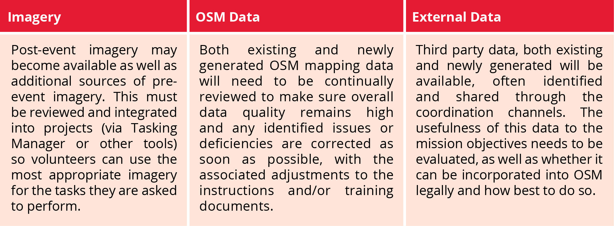

# Critical Responsibilities

Ultimately HOT entrusts the fulfillment of the Activation, the health and safety of all the participants and the ultimate results of an Activation to those who voluntarily accept to follow the protocol and be an Activation Lead.

## Items to Read

### Required Readings

Activation Leads will be under the supervision of the Executive Director and will be expected to strictly adhere to both of these documents:

* [The HOT Code and Code of Conduct](https://www.hotosm.org/code-of-conduct)
* [The Activation Protocol](https://www.hotosm.org/downloads/HOTActivationProtocol.pdf)

## Phase 1: Determining Response Lesson

This lesson walks through the responsibilities of Activation Leads during Phase One of the Activation Protocol.

### Size-up

As an event is predicted or unfolds, it is the collaborative effort of the Activation Leads, the Activation Working Group and the Executive Director of HOT to determine how to appropriately respond; not all disaster events require or would benefit from an Activation. To determine the appropriate response, a size-up must be made to determine:

* The type of the event: sudden onset, slow onset or protracted crisis
* The geographic scope: single or multiple village to city size, city to a country/region, country/region to global
* The estimated humanitarian impact: less than ten thousand people affected, between ten and hundreds of thousands, or more
* The estimated duration: days, weeks, months, years
* The current capacity from HOT to respond: are there other Disaster Mapping taking precedence/can an Activation Team be formed?

Some other considerations that could be tasked to Data, Imagery and other Activators are:

* The estimated needs/state of the map in the area of interest \(are there COD missing?\)
* The availability of imagery for pre-disaster/preparedness mapping

  \*The availability of known 3rd party data \(potentially for import/potentially better data than would be generated quickly\)

### Explore Response Options

With a size-up complete, message the Activation Working Group either with a recommendation on response, or as a question to the group. Some reasons you may want to gather more feedback are:

* To determine if HOT has a community member or contact within the local OpenStreetMap community.
* To determine the availability of other Activation Leads if the scope and/or duration will require multiple leads.

Compare the results of the size-up and discussion with the response matrix:

### Choose a Response

HOT expects that the Activation Lead\(s\) exploring a response make careful consideration of the event as well as other factors when making a decision; if the scope of the disaster is expected to be major - it is required that the Executive Director be notified before an Activation is announced. Using the size-up and response matrix, determine an appropriate response:

* HOT Support: any event can be supported by HOT and/or individual Activators when it is not appropriate for Activation. This support can be many things, typically those are: guidance with Imagery, Imports and/or tagging schema; and outreach through our mailing lists and other platforms to recruit mappers.
* Local Project: typically if there is a local OpenStreetMap community, especially when one or more of the community are engaged or trained HOT volunteers, it is best to support their initiatives and only activate if specifically requested to do so; often our liaisons assist with connecting local communities with response organizations.
* Missing Maps: the mission of Missing Maps fits best with regions of the world where the is little to no local mapping community and high vulnerability to disaster; typically slow onset or protracted crisis type events may better fit Missing Maps than getting into a long, drawn-out Activation that will take much more scheduling and continual calls to motivate mappers.
* HOT Activation: when there are requests that can be fulfilled by an Activation, or a COD is identified as missing and HOT has the resources to assist, Activation Leads should immediately begin preparation for activating.

### Declaring an Activation

If it is determined to respond with an Activation, follow these steps:

* If no local leadership was identified in the decision, try to identify local mappers to assist, either by a country/regional mailing list or by exploring the OSM history of the area.
* Standing Up a Team, in general recruit at least enough of a Team to handle immediate needs and begin preparing for shift coverage and long-term staffing needs.
* Activation Leads will be ultimately responsible for all communications, especially internal, decide and prepare the tools to be used.
* With the assistance of the Public Relations and Reporting roles, establish a wiki-page, website project page or other method for keeping mappers, media and general public informed.
* Assist the Tasking, Data and Imagery roles in creating the initial projects; Activation Leads need to ensure the appropriate Partner Liaisons are also informed and included in any requests or other collaborations.
* Assist in the collection and dissemination of 3W information, Partner Liaisons and Reporting Activators can assist, but Activation Leads should be included when organizations request HOT's 3W info.
* Possibly tasked to Public Relations or another Activator, the Activation Lead\(s\) need to ensure that our volunteers, partners, stakeholders and general public listening to HOT channels is fully aware of the Activation.

### Review

Activation Lead\(s\) are ultimately responsible for declaring an Activation once it has been determined to be the appropriate response.

* True
* False

## Phase Two: Response Activities

### Maintain Communications

The Public Relations, Community Care and Partner Liaisons will mostly handle basic communication, but often may need the Activation Lead to provide guidance, talking points or clarification. Activation Leads should be able to answer yes to the following:

* Is communication triage effective and being maintained?
* Is communication with partner organizations going well?
* Is the team able to maintain communications with local OSM communities?
* Are HOT event pages \(wiki and/or website\) up-to-date?

If any of the answers are no, it is the Activation Lead\(s\) responsibility to improve communications; potentially recruiting more Activators. Any urgent or un-resolvable issues need to be elevated to the Executive Director.

### Ongoing Review

Often delegated to the Data, Imagery or other roles; these items will need constant review; Activation Lead\(s\) are ultimately responsible for keeping that review going throughout an Activation.

### Mapping Activities

Further outlined in the Activation Protocol, these items need to be managed by the Activation Lead\(s\) and/or delegated to team members:

* Data Model - the appropriate data model may change from the initial projects and continue to be dynamic.
* Onboarding New Mappers - depending on the scope and media coverage, and Activation can generate thousands of first time contributions.
* Mapping Projects - as priorities change, it is needed to constantly monitor and update project accordingly.
* Mapping Progress - tied to the projects, ensure progress is also be monitored and reflected in reporting and priorities.
* Achievement - make sure documentation and reporting is also recognizing achievements.
* Coordination - most importantly assure and assist partner organizations to make clear requests that help fulfill their mission.

### Data Projects and Tech Issues

Closely related to helping partner organizations make clear requests that mappers can fulfill, assistance may be required in getting and using the data. Typically tasked to the Usability role, Activation Lead\(s\) may need to be involved to oversee that data is efficiently delivered and that 'down-stream' users will know limitations, expectations and limited liability of OpenStreetMap.

Also, every so often, the HOT tools and services provided run into a technical glitch. If the Activation Team cannot resolve the issue internally, the Activation Lead\(s\) should email sysadmin@hotosm.org and/or jump on the \#sysadmin Slack channel to discuss and make aware the system administrators. Make sure to follow-through and test that the issue has been resolved.

### Monitor Event Scope

This is likely a team effort, as well as the global community might help monitor and maintain situation awareness of the event. Keeping a constant view of the situation as well as looking long-term will help determine when the Activation should enter Phase 3.

### Review

Which one of the following is NOT an ongoing responsibility/activity of the Activation Lead\(s\) in Phase 2: Response Activities of the Activation Protocol?

* Maintaining communication with the local OpenStreetMap community.
* Monitoring the scope of the event to determine when to enter Phase 3.
* Managing the mapping project\(s\) and priorities.
* Posting minutes of the Activation Working Group meetings

## Phase Three: Activation Conclusion

### Review and Conclude Mapping

When an Activation is approaching it's conclusion, a high-level and thorough review of the map data needs to occur; often tasked to the Validation Activator\(s\) to recruit mappers and validators to finish and validate the Tasking Manager projects as well as large area validation to ensure consistent and appropriate tagging for things such as the road network, new building tagging and other common features needing correction.

As projects are completed, ensure the documentation and reporting are also being updated for conclusion; messaging should also reflect this 'de-escalation' of activities. Often this is tasked to the Reporting and Public Relations Activator\(s\).

### Local Capacity and Long-term Support

When the HOT Activation concludes, the map progression will transition back to 'normal OSM editing'; this should be expressed to the local community and assistance offered to continue promoting mapping in the region and expanding the capacity of the local community to maintain and continue to improve the map.

Often new projects may be created with less urgency/priority \(possibly on another Tasking Manager instance\) to fill-in gaps between priority areas during the response. If the local community could benefit from more assistance, consider and discuss with Missing Maps and/or our Partner Liaisons to discuss with their counterparts a potential community development or Missing Maps project in the region.

### Conclude and Review

As the project\(s\) are completed, the Activation Lead\(s\) need to prepare to announce the end of activities to our partners, mappers and other stakeholders, this is often done with assistance or tasked to Reporting, Partner Liaisons and Public Relations.

Before that happens, ensure the Activation Team is debriefed and has a chance to participate in an Activation Review \(this is explained in the Reporting Role course, please review\).

Finally, the Activation Leads should ensure that any lessons learned and especially any issues identified are communicated with the appropriate people or working groups to explore solutions and make recommendations for the next response.

### Review

The Activation Lead\(s\) must ensure an Activation Team debriefing and Activation Review is conducted before or immediately after its conclusion.

* True
* False

