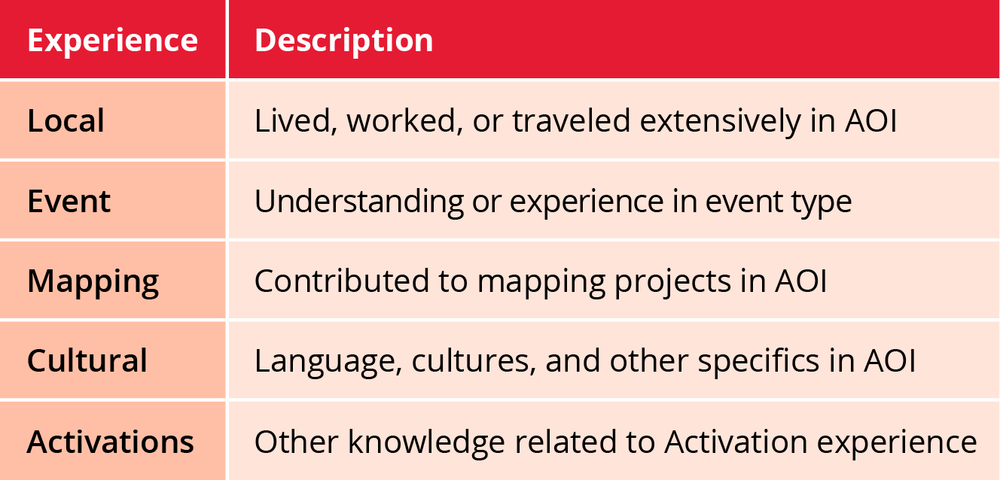
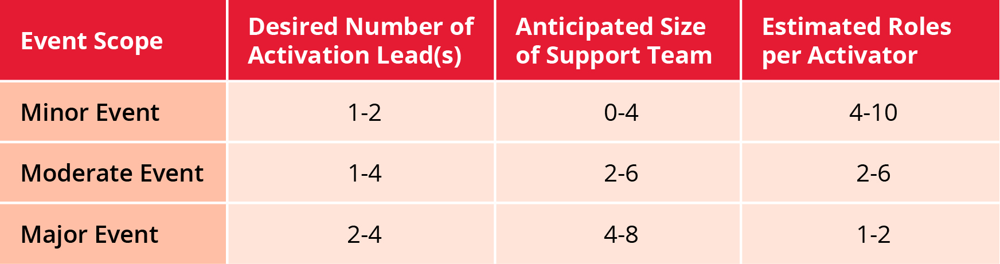

# Leading an Activation

This course is required training for, and will teach the essential knowledge required to perform as an Activation Lead during an Activation.

A key indicator of an effective leader is how well the people around them perform, being able to quickly assess the staffing needs of an Activation, scale the team as change occur, keep staff engaged and preventing burnout is all part of the Activation Lead role.

## Staffing the Team

As hopefully expected, Activation Lead is mostly about managing others, that starts with thinking about staffing and managing staff\(Activation Team\) throughout the Activation.

### Span of Control

There is no magic number of subordinates that make up the perfect team, one might think that the more the better, but that is not true. Depending on the estimated duration, complexity and other event factors it has been found in emergency management, that one person can only effectively manage 4-8 people. For Activations that means that each Activation Lead should 'be in charge'/responsible for no more than 8 people and can more effectively manage between 4-6.

### Size of the Team \(Leads\)

Once an event size-up has been performed, Activation Leads should first consider what time-zone coverage is needed. If the even is of a moderate or minor scope and not a lot of international attention is expected, then one or two local leads should be sufficient.

If there is no local leadership and/or it is expected that multiple time zone medias will be covering the story and generating inquiries; then it may take 4 or possibly even more Activation Leads to properly provide leadership 'in shifts' covering the majority of all day every day for at least the initial days or weeks.

Also be prepared to scale up and down the number of Activation Leads and make sure that there is a 'shift handover', if the Lead that is supposed to be there for the hand-off is unresponsive or unavailable, inform the Executive Director and/or the Activation Working Group so that someone can at least monitor for traffic that will need to be picked up during the next availability of an Activation Lead.

### Size of the Team \(Support\)

When considering how many support roles should be recruited for support, this will most likely be closely tied to the scope and estimated duration of the event. The larger the area to be mapped, the more work for the Tasking, Data, Imagery and Validation roles. As with Leads, the more international media attention, the more Public Relations and Community Care roles will be needed.

Partner Liaisons are assigned their roles by the Executive Director 'semi-permanently' to maintain and be a direct contact for our partners; for moderate to large scale events especially if mapping in an area we have not recently or when getting multiple requests, ensure one is helping coordinate communications.

Often the Reporting role can be a secondary task for an Activator, but for major events, one should be assigned. The exact number can be dynamic and potentially liaisons, public relations and other Activators may only be needed during critical portion. Most importantly the number of support roles should be within the span of control of the Leads and complement each other to ensure all roles will be filled.

### Team Dynamics

As well as numbers, the Activation Lead\(s\) need to consider various factors related to the experience of the individual Activators in order to have the best team dynamics for a successful Activation.

### Putting it Together

With the scope and team dynamics in mind, create a team accordingly.

### Review

What is the minimum number of Activation Leads suggested for a successful Activation with a Major Scope?

## Managing the Team Lesson

It one thing to set up a Tasking Manager project and ask for mappers, it is another to ask and keep tabs on a team of remote coordinators.

### Leadership Style

There are many styles of leadership, all of which can be successful. These are suggested leadership styles for effective coordination during an Activation:

* Leading by example: probably the most common, leading by example suggests the Activation Lead\(s\) are working along side the team, setting the pace and demonstrating best practices. 
* Positive and negative reinforcement: positive reinforcement usually works best, simply recognizing a job well done and giving a verbal thank you might be enough, using that job well done as an example for the rest of the team may or may not - some people shy away from public recognition; negative reinforcement should never be more than explaining to an Activator what they have done wrong and how you would like to see the task performed in the future.
* Delegation: the level of responsibility/trust that Activators deserve will be discussed later in the lesson, however effective leadership will require some level of delegation; allowing decisions to be made by individuals or the team is often also a form of positive reinforcement.

### Volunteer Types

There are many explanations of different types of volunteers and how to keep them motivated and on track; there is a simple description in an article on Volunteer Weekly. Beyond how to recognize and handle individual personalities/types of volunteer; there is also a level of trust necessary for tasking and how much monitoring the Activation Lead\(s\) will need to do:

* New - this volunteer is a trainee or maybe endorsed by an Activator that is unknown to the Activation Lead\(s\); care should be taken to both build that trust and ensure that tasks delegated to this person are completed sufficiently.
* Unfamiliar - this volunteer is maybe endorsed by someone familiar, but has little track record with the current Activation Lead\(s\); care should be taken to build the trust but maybe needs less oversight than a new Activator.
* Familiar - this volunteer is endorsed by another well known Activator or has a proven track record, trust should be easy to build and tasks should not need much oversight or follow-up.
* Well Known - this volunteer has a well known proven track record, trust is already created and it can be safely assumed tasks will be completed or the volunteer will ask for assistance on their own with little need for Activation Lead oversight.

### Team Health and Safety

Ultimately the safety and security and to some degree the health of the Activation Team is the responsibility of the Activation Lead\(s\). Make sure to understand all the risks and mitigation tactics outlined in the Community Care course.

HOT expects that Activation Leads look out for each other, stay available for any of their team's needs and in the long-run keep the Activation Roster healthy and growing rather than burned-out and unresponsive to requests for Activation Team members.

The Directors of HOT as well as the Activation Working Group expect that Activation Leads fulfill the protocol and reserve the right to inform the Executive Director of real or perceived shortcomings and at their discretion you may be demoted from lead or removed from the Activation Roster entirely. If an Activation Lead feels an Activator or Trainee is not cooperating or otherwise undeserving of a spot on the roster, they should immediately inform the Executive Director of HOT.

### Review

What level of trust would you give the following volunteers:

* A trainee or someone who was endorsed by an Activator not familiar to anyone on the team; they should not be immediately trusted with important decisions and Activation Lead\(s\) should closely monitor and follow-up on tasks.
* This type of Activator has been endorsed, but is relatively new or their track record is unknown to the Activation Lead\(s\), they can be tasked to work independently but maybe not with important decisions and some follow-up should occur.
* This type of Activator has a good track record and some level of trust should be easy to establish; little oversight it required by the Activation Lead\(s\).
* This type of Activator is well known to most if not all Activation Leads, should be trusted to carry out most any task and make decisions with little to no oversight.

