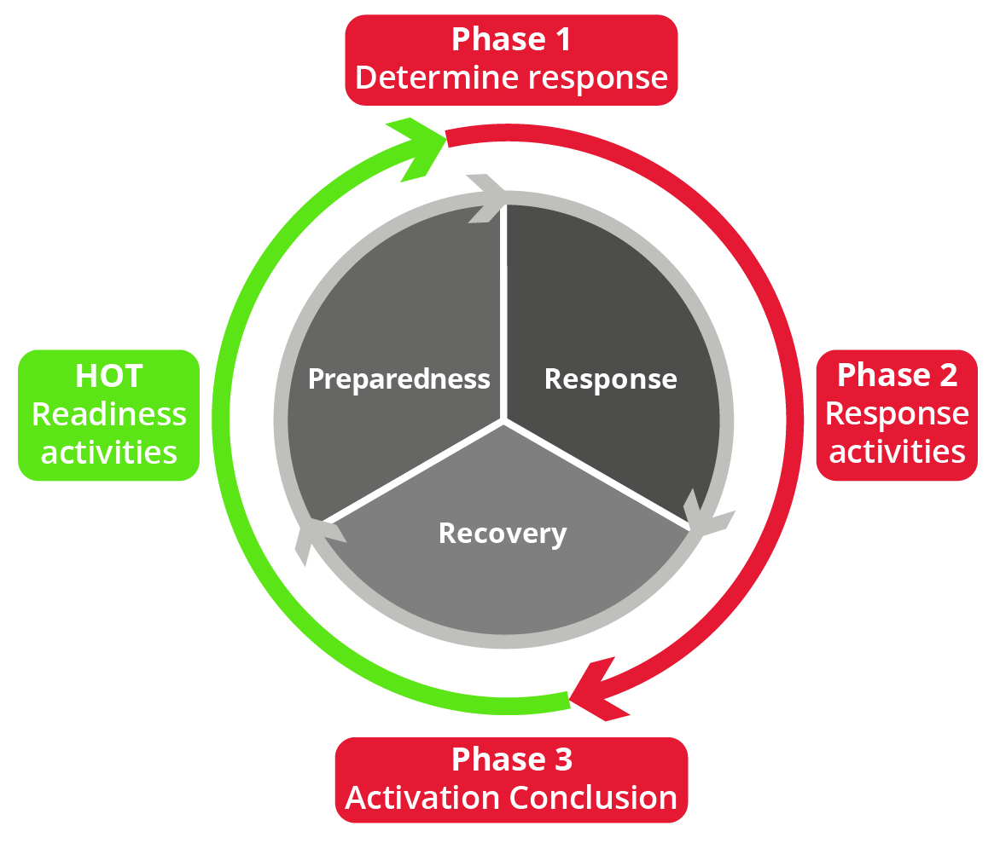
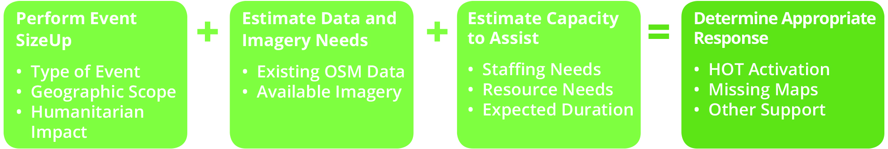
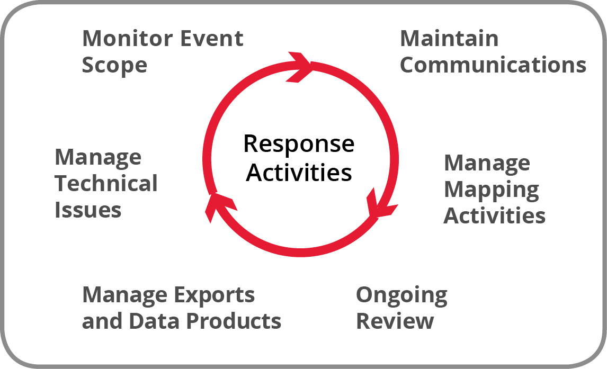
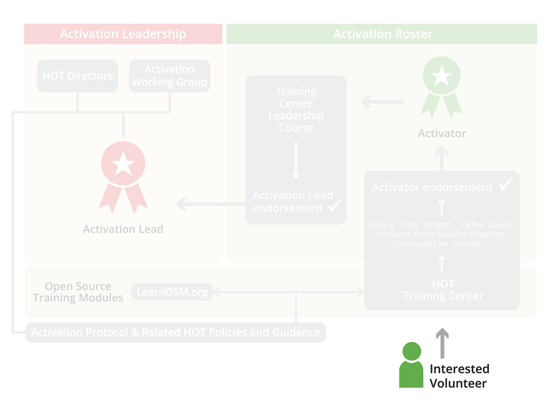
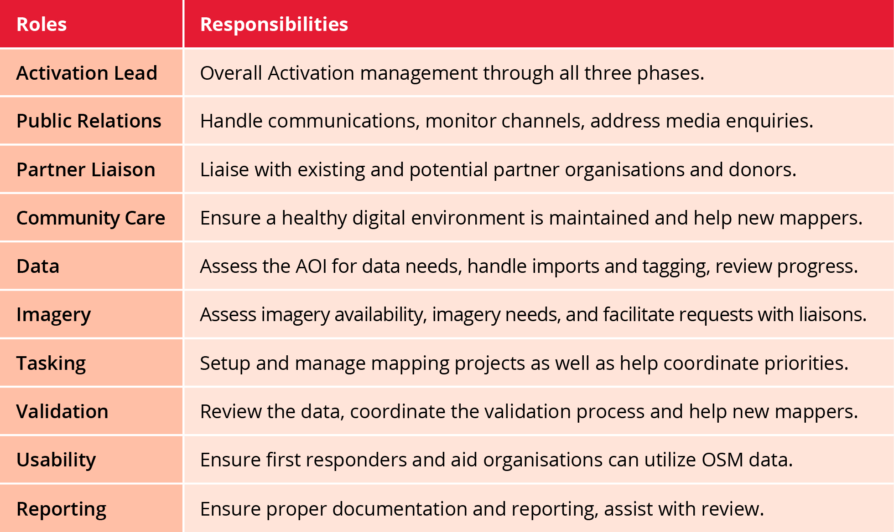

# Activation Walkthrough

Now lets explore the details of when and how HOT activates and the activities performed during the three phases.

## Items to Read

Activators are required to be familiar with all the LearnOSM content. For this course, make sure to familiarize yourself with the modules in the Coordination Section.

[LearnOSM Coordination Section](https://learnosm.org/en/coordination/)

## Activation Phases

### Phases of HOT Activation

This lesson teaches the phases of an Activation and the activities performed. The Activation Protocol defines the flow of activities involved during an HOT Activation and describes how our trained volunteers perform the tasks that lead to a successful and efficient response.

An Activation is broken down into three phases:

* Phase 1 Determine Response
* Phase 2 Response Activities
* Phase 3 Activation Conclusion

Another key aspect of effective Activation is [HOT Readiness](http://courses.hotosm.org/mod/lesson/view.php?id=33) \(Phase 0 - discussed in Unit 1: Activation Anatomy\), which aims to keep the HOT community prepared to respond when called upon. 

### Phase 1: Determine Response

The HOT Activation leadership discuss various factors around an event to determine an appropriate response.

HOT expects that the Activation Lead\(s\) have been diligent in performing a size-up, reviewing data and imagery, estimating the resource needs, and that they agree to fulfill this Activation Protocol before declaring an Activation.

### Phase 2: Response Activities

 Over the duration of an Activation many activities are repeated, maintained and monitored. Activation Lead\(s\) ensure these are managed and taken care of throughout the entire Activation.

### Phase 3: Activation Conclusion

Concluding the Activation consists of completing and validating the remaining Tasking Manager projects, making sure to reflect the changes in priority on the Tasking Manager, wiki-page and other messaging, completing documentation and reports and reviewing the Activation to improve the next response. 

### Review

During which phase is a decision is made for an appropriate HOT response by the Activation Lead\(s\) after discussion with the Activation Working Group and/or Directors?

People reading this material for credit on [the HOT Courses website](http://courses.hotosm.org/) can get the answer there. If anyone has any question about the correct answer to a Review question, please ask in the \#courses channel of HOT's Slack \( [Register](http://slack.hotosm.org) \).

## Activation Roster

This lesson teaches a volunteer about the Activation Roster and the significance of the team roles.

### Activation Roster

Volunteers are required to complete training \(as you are doing in this course\) as well as receive endorsement from an existing Activator to be recognized as able to perform activities on behalf of HOT. The path for becoming a Trainee, then Activator and ultimately an Activation Lead is visualized in the Activator Career Path diagram. 

### Activation Roles

After successfully completing this Activation Essentials course, you will have access to training for these 10 Activation Roles: 

* Note that in order to begin the training course for Activation Lead, you must first complete all other training and be peer endorsed as an Activator.

### Review

Which Role performs the event size-up?

* Public Relations
* Data Role
* Communications
* Activation Lead
People reading this material for credit on [the HOT Courses website](http://courses.hotosm.org/) can get the answer there. If anyone has any question about the correct answer to a Review question, please ask in the \#courses channel of HOT's Slack \( [Register](http://slack.hotosm.org) \).

