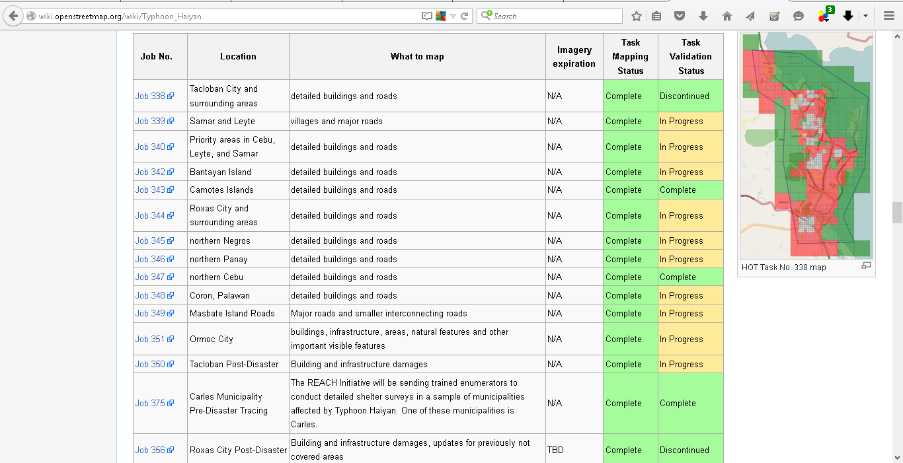

# Recognize Achievements

As well as keeping good documentation of Activation progress, we also need to tell the public and more importantly our volunteer mappers how beneficial our mission is.

### Items to Read

[Nepal 2015 Earthquake Reports](https://hotosm.org/projects/nepal_2015_earthquake_response)

Although reporting is done in a variety of methods, a good example is the updates \(blog-posts\) attached to the HOT webpage for the Nepal 2015 Earthquake response, take a moment to review the posts.

## Effective Reports Lesson

The HOT community will map a community in need without any sort of motivation or direct knowledge of direct benefit \(because there's always the permanent benefit of growing OSM\); however, timely reports of progress and usage can go a long way to fulfilling our Activation objectives quickly and efficiently.

### Volunteer Mappers

The vast majority of the millions of OpenStreetMap registered user accounts are non-mapping-expert volunteers. When disaster strikes, the common desire to assist drives many of those existing contributors to map the affected area; when news breaks of HOT's response or our partners' use of OSM there is often an influx of brand new contributors. Reporting is essential to inform new and expert mappers alike, ensure they have the information they need to participate and that first responders and aid organization know what data is available. 

### Maintaining the Wiki

Typically one of the best ways to keep track of overall progress \(especially during an Activation requiring many Tasking Manager projects\) is to maintain a table on the wiki-page. 

### Making Clears Asks

Although the average volunteer mapper is willing to spend many hours a day while the event is in the headline news, reporting becomes essential to maintain any significant level of response as the story fades. Also if the event hasn't made headlines yet, or isn't expected to, the Reporting role will often spend a significant portion of their time working with the Activation Lead\(s\), Tasking and Public Relations Activators to ensure the community knows that there are mapping needs, how they can best contribute and how their contributions are being utilized by first responders and aid organizations in the field. A combination of emails, website updates and social media campaigns should be used to reach the largest audience. The [Communications Working Group](https://www.hotosm.org/community/working-groups/) can provide review, help with drafting messaging and ensure you have access or can assist in making posts on all the HOT communication platforms; however it will be up to the Activation Team to formulate the asks and reporting the community needs to know.

### Review

The Activation Team, mainly those Activators in the Reporting role are responsible for communicating mapping needs throughout a response; the Communication Working Group only provides assistance when requested.

* True
* False

People reading this material for credit on [the HOT Courses website](http://courses.hotosm.org/) should share their answer in the \#courses slack channel on HOT's Slack \( [Request Invite](http://slack.hotosm.org) \) If anyone has any question about the correct answer to a Review question, please ask in the \#courses channel of HOT's Slack.

## Tips and Tricks

### High Impact Tools

For that extra motivation and/or gratification, here are some examples of reporting tools that really demonstrate the power of an HOT Activation:

* A [Before and After Map of Nepal](http://pierzen.dev.openstreetmap.org/hot/leaflet/OSM-Compare-before-after.html#11/27.7665/85.4345)
* A series of tools at [ResultMaps](http://resultmaps.neis-one.org/) including one for showing [New Mappers](http://resultmaps.neis-one.org/newestosm?zoom=9&lat=27.92779&lon=85.18661&layers=0B0TTT)
* An animation of [Road Tracing](https://www.mapbox.com/blog/nepal-earthquake-animation/) during the first days of Nepal Activation.
* A comprehensive [Statistics 'Storyboard'](http://osm.townsendjennings.com/nepal/) from Nepal Activation.

  As you may note, many of these were created by partners or community members not directly involved with the Activation Team.

### Capturing Usage Stories

It is typically easier to tell the story of how effective our geodata generation is progressing versus how beneficial that activity is to first responders and aid organizations in the field. Work with the Partner Liaisons to solicit feedback and stories that showcase OSM usage for directly providing aid. This is typically what will most effectively motivate the new mapper to continue and the experienced mapper to feel recognized for what is a mostly thankless task for someone casually contributing from the comfort of their own home. Often we hear that people don't think what they are doing is fulfilling any need and the complexities of using appropriate tags, the OSM workflow and dynamic priorities can be discouraging. One example of OSM contributing to a life-saving rescue effort or large-scale aid operation planned solely with the newly generated OpenStreetMap data can overcome the many challenges faced throughout an Activation.

### Usage Examples

Here are a few examples that showcase OSM usage and helped contribute to a more motivated volunteer workforce:

* [Ebola Tracking](http://umap.openstreetmap.fr/en/map/ebola-e-tracking-in-sierra-leone-liberia-and-guine_12522#7/6.474/-10.789) in Sierra Leone
* [Quakemap.org](http://quakemap.org/) for coordinating needs reports after the Nepal Earthquakes
* [GDAC Map](https://unosat.maps.arcgis.com/apps/webappviewer/index.html?id=b9f9da798f364cd6a6e68fc20f5475eb) for responding to the Nepal Earthquakes

  The Reporting Activator\(s\) are not creating these, but adding links to them on the Activation wiki-page and linking them in blog-posts, emails and other messaging.

### Review

Reporting Activators are required to use a specific tool to recognize the achievements made during an Activation.

* True
* False

People reading this material for credit on [the HOT Courses website](http://courses.hotosm.org/) should share their answer in the \#courses slack channel on HOT's Slack \( [Request Invite](http://slack.hotosm.org) \) If anyone has any question about the correct answer to a Review question, please ask in the \#courses channel of HOT's Slack.

